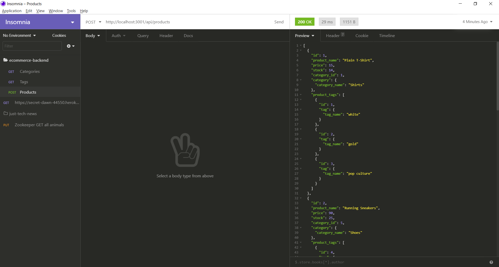

# E-commerce Back End Starter Code

## Screenshot:

## DESCRIPTION: 
AS A manager at an internet retail company
he/she wants a back end for my e-commerce website that uses the latest technologies
SO THAT the company can compete with other e-commerce companies

## INSTALLATION
USER can run 'source schema.sql' from db folder using mysql shell command to create the database and table if it does not exist.
USER can run 'npm run seed' to populate tables with dummy values.
USER can run 'npm install' to install all the dependent modules.

## USAGE:

GIVEN a functional Express.js API

WHEN user adds database name, MySQL username, and MySQL password to an environment variable file
THEN he/she will be able to connect to a database using Sequelize

WHEN user enters schema and seed commands
THEN a development database is created and is seeded with test data

WHEN user enters the command to invoke the application
THEN the server is started and the Sequelize models are synced to the MySQL database

WHEN user opens API GET routes in Insomnia Core for categories, products, or tags
THEN the data for each of these routes is displayed in a formatted JSON

WHEN user tests API POST, PUT, and DELETE routes in Insomnia Core
THEN he/she will be able to successfully create, update, and delete data in the database.

## TECHNICAL DESCRIPTION: 
MySQL2, Sequelize, dotenv and Express.js packages are used.